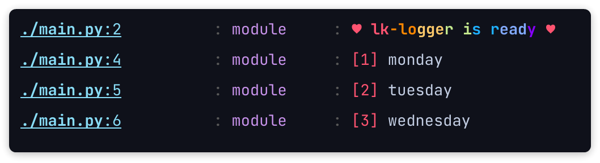
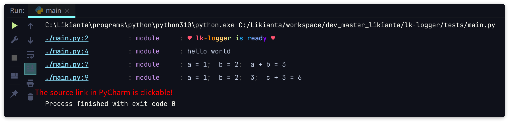
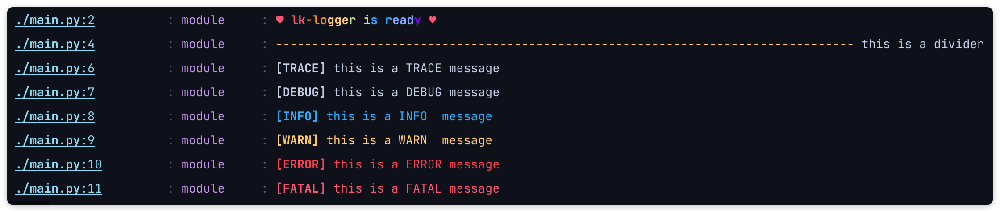
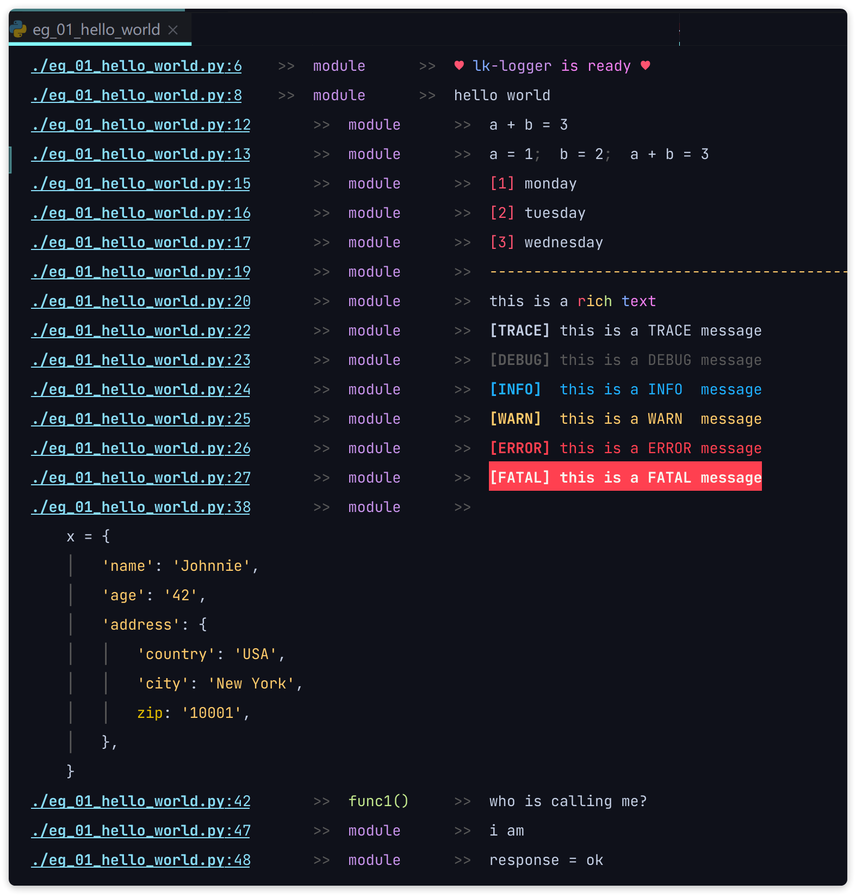

# LK Logger

Advanced print tool for Python.

Features:

- Simple. Add two lines of code to enable lk-logger.

    ```python
    import lk_logger
    lk_logger.setup()
    ```

    It will replace Python's built-in `print` function to take care all the leftovers.

- Non-intrusive. After enable it like above, no more modifications on your source code projects (this is low-cost and low-effort migration). You will see new effects at once.

    This would be a good choice for developers who have already dived into their own projects with Python `print` too much to get a new start with a new logging tool.

- Code highlight.

    

- Show both varnames and values.

    before:

    ```python
    a, b = 1, 2
    print('a = {}, b = {}, a + b = {}'.format(a, b, a + b))
    ```

    after:

    ```python
    import lk_logger
    lk_logger.setup(show_varnames=True)
    a, b = 1, 2
    print(a, b, a + b)
    ```

    

## Install

```shell
pip install lk-logger
```

The latest version is 5.0.0 or higher.

## Quick Start

```python
import lk_logger
lk_logger.setup(show_varnames=True)

print('hello world')

a, b = 1, 2
print(a, b, a + b)

print(a, b, (c := a + b), c + 3)
```

Screenshot:



## Advanced Usage

Generally, the two lines of code above are enough to use.

The advanced feature is its "markup" shorthand.

Use a markup as in the first or the last parameter, the markup is a string that starts with ':', consists of multiple marks.

For example:

```python
print(':i', 'monday')
print(':i', 'tuesday')
print(':i', 'wednesday')
```

It prints weekdays with a numeric prefix:


Another one:

```python
print('this is a divider', ':d')

print(':v0', 'this is a TRACE message')
print(':v1', 'this is a DEBUG message')
print(':v2', 'this is a INFO  message')
print(':v3', 'this is a WARN  message')
print(':v4', 'this is a ERROR message')
print(':v5', 'this is a FATAL message')
```



**Here is a list of all available marks:**

| Mark | Description                                  |
| :--- | :------------------------------------------- |
| `:d` | divider line                                 |
| `:i` | index                                        |
| `:l` | long / loose format (multiple lines)         |
| `:p` | parent layer                                 |
| `:r` | rich format                                  |
| `:s` | short / single line format                   |
| `:t` | timestamp (not available in current version) |
| `:v` | verbosity / log level                        |

**Markup options:**

```
:d0     default divider line (default)
:d1+    user defined (if not, fallback to :d0)

:i0     reset index
:i1     number width fixed to 1 (1, 2, 3, ... 9, 10, 11, ...) (default)
:i2     number width fixed to 2 (01, 02, 03, ..., 99, 100, 101, ...)
:i3     number width fixed to 3 (001, 002, 003, ..., 999, 1000, 1001, ...)
:i4+    number width fixed to *
:i9+    reserved, not defined yet (will be fallback to :i1)

:l0     let lk-logger decides how to format long message (default)
:l1     force expand all nodes

:p0     self layer
:p1     parent layer (default)
:p2     grand parent layer
:p3     great grand parent layer
:p4     great great grand parent layer
:p5+    great great great ... grand parent layer
        note: be careful using :p2+, it may crash if the layer not exists

:v0     trace
        if you don't like using number, you can use an alias :vT
        (:vT is not supported in current version. we'll bring it soon)
:v1     debug (alias is :vD) (default)
:v2     info (alias is :vI)
:v3     warning (alias is :vW)
:v4     error (alias is :vE)
:v5     fatal (alias is :vF)
:v6+    user defined (if not, fallback to :v0)
```

**Detailed examples:**

See [examples/02_all_markup_usages.py](examples/02_all_markup_usages.py).

Screenshot:



## Caution

- The back slash will be forcely converted to forward slash.

    ```python
    print(r'C:\Users\<Username>\AppData\Local\Temp')
    ```

    

    There remained an unresolved issue in its internal parser. We will fix it in future version.
