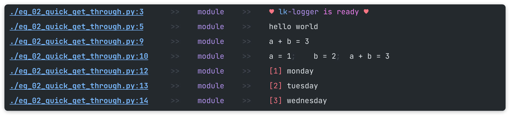
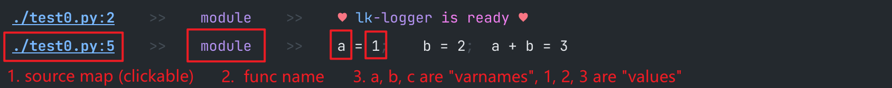
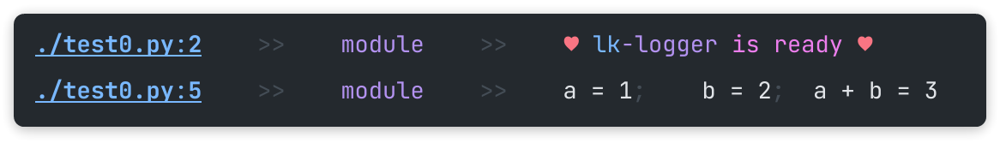
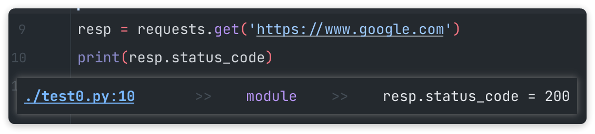
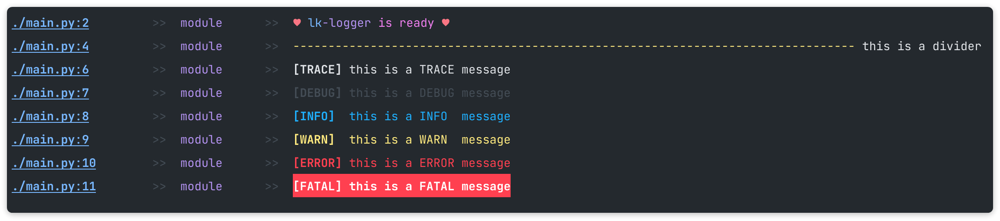
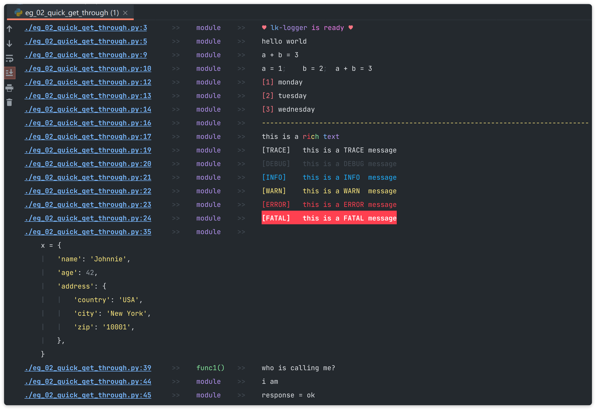

# LK Logger

[中文版](https://blog.csdn.net/Likianta/article/details/124358443)

An alternative to Python built-in `print` function.



Features:

-   Show source map, function name and varnames in console.

    

-   Easy and simple.

    ```python
    # add this
    import lk_logger
    lk_logger.setup()

    # then remain using `print` as usual...
    print('Hello world')
    print(123, 456, 789)
    ...
    ```

    It will replace Python's built-in `print` function to take care all the leftovers.

-   Simplify writing:

    ```python
    # before
    a, b = 1, 2
    print('a = {}, b = {}, a + b = {}'.format(a, b, a + b))

    # after
    print(a, b, a + b)
    ```

    

    (Another example)

    

-   Non-intrusive. Once import lk-logger, there's no more modifications to your code. Just follow the way you are using `print` **as usual**.

-   Code highlight.

    

## Install

```shell
pip install lk-logger
```

The latest version is 5.4.0 or higher.

## Quick Start

```python
import lk_logger
lk_logger.setup(show_varnames=True)

print('hello world')

a, b = 1, 2
print(a, b, a + b)

print(a, b, (c := a + b), c + 3)
```

Screenshot:


## Advanced Usage

Usually the above example is enough to use.

The advanced feature is **"markup"** shorthand.

A markup is a string starts with ':', layed on the first or the last position of positional arguments, and consists of multiple marks.

For example:

```python
print(':i', 'monday')
print(':i', 'tuesday')
print(':i', 'wednesday')
```

It prints weekdays with a numeric prefix:


Another one:

```python
import lk_logger
lk_logger.setup()

print('this is a divider', ':d')

print(':v0', 'this is a TRACE message')
print(':v1', 'this is a DEBUG message')
print(':v2', 'this is a INFO  message')
print(':v3', 'this is a WARN  message')
print(':v4', 'this is a ERROR message')
print(':v5', 'this is a FATAL message')
```



**Here is a list of all available marks:**

| Mark | Description                                  |
| :--- | :------------------------------------------- |
| `:d` | divider line                                 |
| `:i` | index                                        |
| `:f` | flush                                        |
| `:l` | long/loose format (multiple lines)           |
| `:p` | parent layer                                 |
| `:r` | rich style                                   |
| `:s` | short/simple/single line format              |
| `:t` | timestamp                                    |
| `:v` | verbosity/log level                          |

**Markup options:**

```
:d0     default divider line (default)
:d1+    user defined (if not, fallback to :d0)

:i0     reset index
:i1     a simple increamental index (starts from 1) (default)

:f0     instantly print a message (default)
:f1     instantly print a message, and drain out message queue in other thread
:f2     wait until all messages in queue are printed, then print this message

:l0     let lk-logger decides how to format long message (default)
:l1     force expand all nodes

:p0     current frame
:p1     parent frame (default)
:p2     grand parent frame
:p3     great grand parent frame
:p4     great great grand parent frame
:p5+    great great great ... grand parent frame
        note: be careful using :p2+, it may crash if the frame count exceeds
        depth limit

:r0     rich style. see also rich's documentation (default)
:r1     rich renderable object, e.g. rich.table.Table, rich.panel.Panel, etc.

:s0     do not show varnames (default)
:s1     do not show source map, function name and varnames

:t0     reset timer
:t1     show time elapsed since last timer starts (default)

:v0     trace (default color)
:v1     debug (grey) (default)
:v2     info (blue)
:v3     warning (yellow)
:v4     error (red)
:v5     fatal (white text on red background)
:v6+    user defined (if not, fallback to :v0)
```

**Detailed examples:**

See [examples/all_markup_usages.py](examples/all_markup_usages.py).

Screenshot:


