# LK Logger

[](https://badge.fury.io/py/lk-logger) [](https://pepy.tech/project/lk-logger) [](https://pepy.tech/project/lk-logger)

[中文版](https://blog.csdn.net/Likianta/article/details/124358443)

An alternative to Python built-in `print` function with rich features.

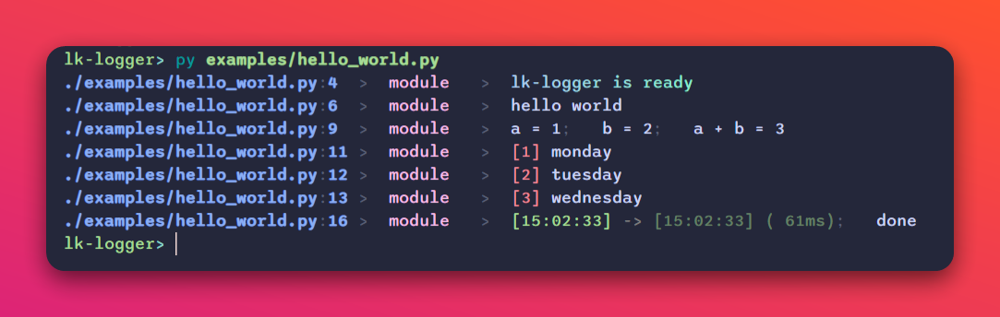

## Features

-   Print with source path, function name and varnames in console.
-   Code highlights.
-   As simple as using `print` like usual.
-   Globally replace `print`.
-   Less code changes, non-intrusive.

## Installation

```sh
pip install lk-logger
```

Requires Python 3.8 and above. The latest version is 6.0.0 or higher.

## Show Me The Code

### Hello world

```py
import lk_logger
lk_logger.setup()
print('hello world')
```

It shows source path, function name (or module name in top lines) besides main content:

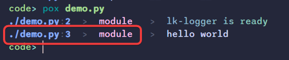

### Print with variant names

```py
import lk_logger
lk_logger.setup(show_varnames=True)
a = 1
b = 2
print(a, b, a + b)
```

`lk-logger` detects the variant or expression from the source code. It is similar but much shorter than the traditional way (`print(f'a = {}; b = {}; a + b = {}'.format(a, b, a + b))`):

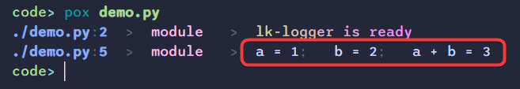

### Prints from third party libraries

For libraries from "site-packages" directory, if they have used `print(...)` in their source code, `lk-logger` will shorten the source path prefixes to be the library names with square brackets.

```py
import lk_logger
lk_logger.setup(quiet=True, show_varnames=True)

import depsland  # pip install depsland
# ^ there are some prints in depsland initial time.
#   let's see the print results.
print(depsland.__version__)
```

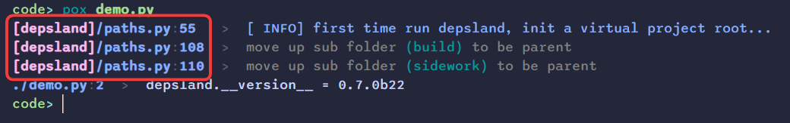

### Highlighting styles

```py
import lk_logger
lk_logger.setup(quiet=True)

print('[red]hello[/] [yellow]world[/]', ':r')
# ^ notice ':r' mark, we'll explain later.

print(':d', 'divider line')

# verbosities
print(':v1', 'debug message')
print(':v2', 'info message')
print(':v3', 'warning message')
print(':v4', 'error message')
print(':v5', 'critical message')
```

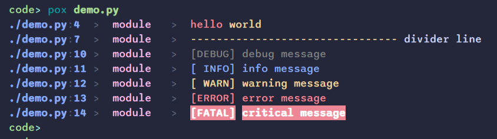

### Exceptions

`lk-logger` depends on `rich` library, it shows pretty exception panel for tracebacks:

```py
import lk_logger
lk_logger.setup(quiet=True)
# try to raise an error
x = 1 / 0
```

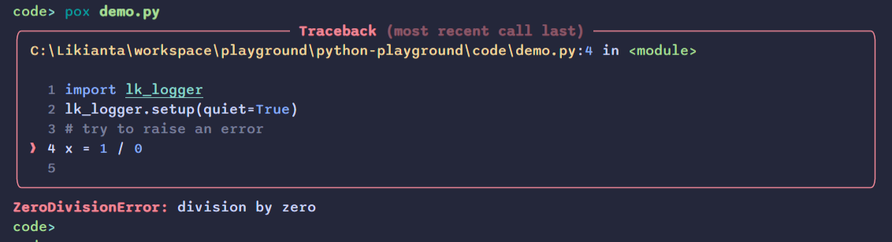

### Using in IPython

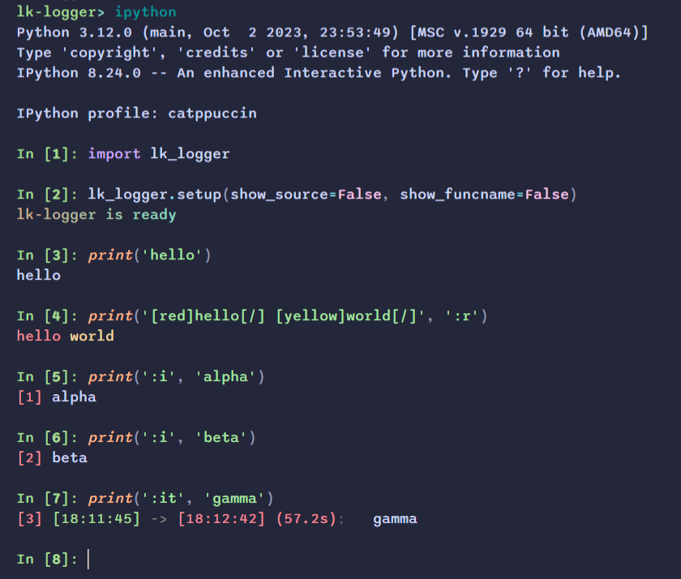

### Indexing and timing

```py
import lk_logger
lk_logger.setup(quiet=True)

print(':d', 'indexing')
print(':i', 'aaa')
print(':i', 'bbb')
print(':i', 'ccc')
print(':i0', 'reset counter')
print(':i', 'ddd')
print(':i', 'eee')
print(':i', 'fff')

print(':d', 'timing')
from time import sleep
sleep(0.1)
print(':t', '... in a short delay')
sleep(1)
print(':t', '... in a little long delay')
sleep(5)
print(':t', '... in a long delay')
```

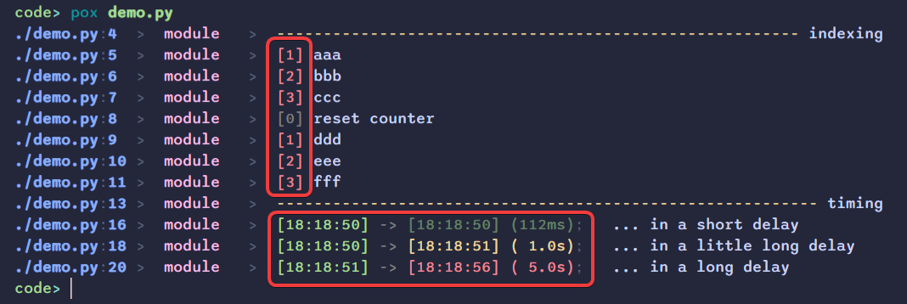

### Reflect source to parent caller

```py
import lk_logger
lk_logger.setup(quiet=True)

def borrow_a_book(name: str) -> None:
    # use ':p' to point to the parent frame
    print(f'user borrowed "{name}"', ':p')

record = []
record.append(('shawn', borrow_a_book('python crash course')))

# after some process
...

record.append(('alice', borrow_a_book('deep learning with python')))
```

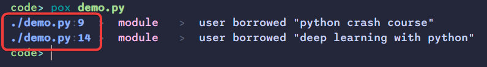

The source info is helpful for developer to track different callers to the same function.

### Redirect printing to other streamers

```py
import atexit
import lk_logger
from lk_logger import parallel_printing

lk_logger.setup(quiet=True)

class MyLogger:
    def __init__(self):
        self._buffer = []
        atexit.register(self.close)
    
    def write(self, msg: str):
        self._buffer.append(msg)
        
    def close(self) -> None:
        with open('log.txt', 'w') as f:
            f.write('\n'.join(self._buffer))

class MyGui:
    def update_ui(self, msg: str) -> None:
        """ send message to GUI log panel. """
        ...

mylogger = MyLogger()
mygui = MyGui()

with parallel_printing(
    mylogger.write,
    mygui.update_ui,
    inherit=True,  # default True. 
    # ^ change to False to prevent default behavior (i.e. printing to console).
):
    print('hello world!')
```

### More markups

Here is a list of all available markups. You can also find them from "examples" folder.

```py
import lk_logger
from rich.markdown import Markdown

lk_logger.setup(show_varnames=True)

# -----------------------------------------------------------------------------
print(':dr', '`:e` is [yellow][u]E[/]xception[/]')

try:
    raise Exception('this is an exception with locals info')
except Exception as e:
    print(':e1', e)

# -----------------------------------------------------------------------------
print(':dr', '`:i` is [yellow][u]I[/]ndexing[/]')

print(':i', 'sunday')
print(':i', 'monday')
print(':i', 'tuesday')
print(':i', 'wednesday')
print(':i', 'thursday')
print(':i', 'friday')
print(':i', 'saturday')
print(':i0')
print(':i', 'sunday in new week')
print(':i', 'monday in new week')
print(':i', 'tuesday in new week')
print(':i', 'wednesday in new week')
print(':i', 'thursday in new week')
print(':i', 'friday in new week')
print(':i', 'saturday in new week')

# -----------------------------------------------------------------------------
print(':dr', '`:l` is [yellow][u]L[/]ong/[u]L[/]oose[/] format')

print(':l', {
    'name': 'John',
    'age': 30,
    'address': {
        'country': 'USA',
        'city': 'New York',
        'street': 'Wall Street'
    }
})

# -----------------------------------------------------------------------------
print(':dr', '`:p` is [yellow][u]P[/]arent[/] frame')


def func1():
    print('who is calling me?')
    print('i am', ':p1')
    return 'ok'


response = func1()
print(response)

# -----------------------------------------------------------------------------
print(':dr', '`:r` is [yellow][u]R[/]ich[/] format')

print(':r', '[cyan]hello[/] [yellow]world[/]')

# print a rich renderable object
print(':r1', Markdown('''
# Hello World

This is a markdown document.

- item 1
- item 2
- item 3

Find more usages at [rich](https://github.com/textualize/rich) documentation.
'''))

# automatically convert a dict to a table
print(':r2', {
    'Name': ('Alice', 'Bob', 'Charlie'),
    'Age': (18, 19, 20),
    'City': ('Shanghai', 'Beijing', 'Guangzhou'),
})

# -----------------------------------------------------------------------------
print(':dr', '`:s` [yellow][u]S[/]hort/[u]S[/]imple/[u]S[/]ingle-line[/] format')

a, b = 1, 2
print(':s', a, b, a + b)  # without varnames
print(':s1', a, b, a + b)  # similar to built-in print (but kept color style)
print(':s2', a, b, a + b)  # totally same with built-in print

# -----------------------------------------------------------------------------
print(':dr', '`:t` is [yellow][u]T[/]iming[/]')

print(':t', 'for now')

# -----------------------------------------------------------------------------
print(':dr', '`:v` is [yellow][u]V[/]erbosity[/]')

print(':v0', 'this is a TRACE message')
print(':v1', 'this is a DEBUG message')
print(':v2', 'this is a INFO  message')
print(':v3', 'this is a WARN  message')
print(':v4', 'this is a ERROR message')
print(':v5', 'this is a FATAL message')

a, b, c = 1, 2, 3
print(':v', a, b, c)
```

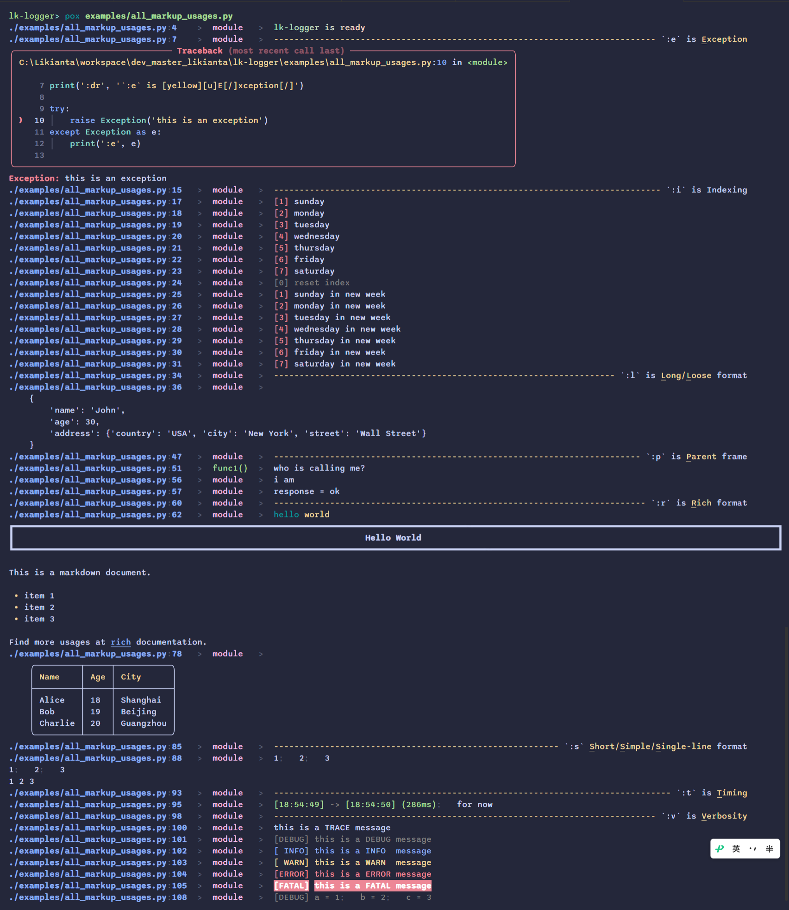

## Gallery / Code Screenshots

Projects using `lk-logger` for their prints:

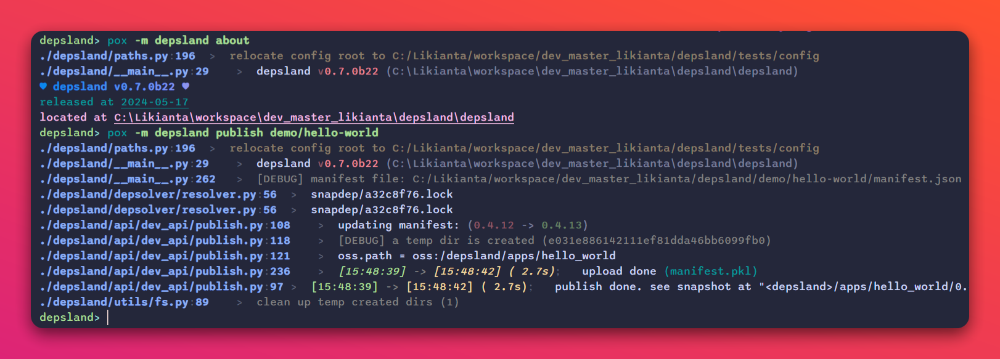

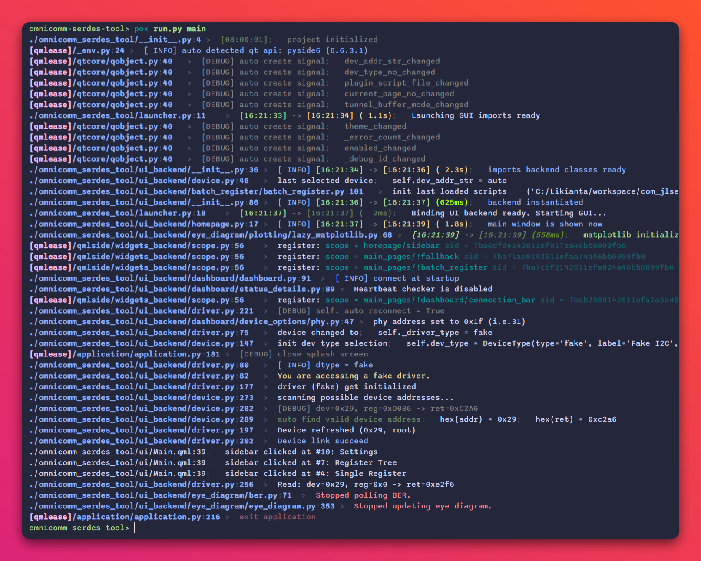

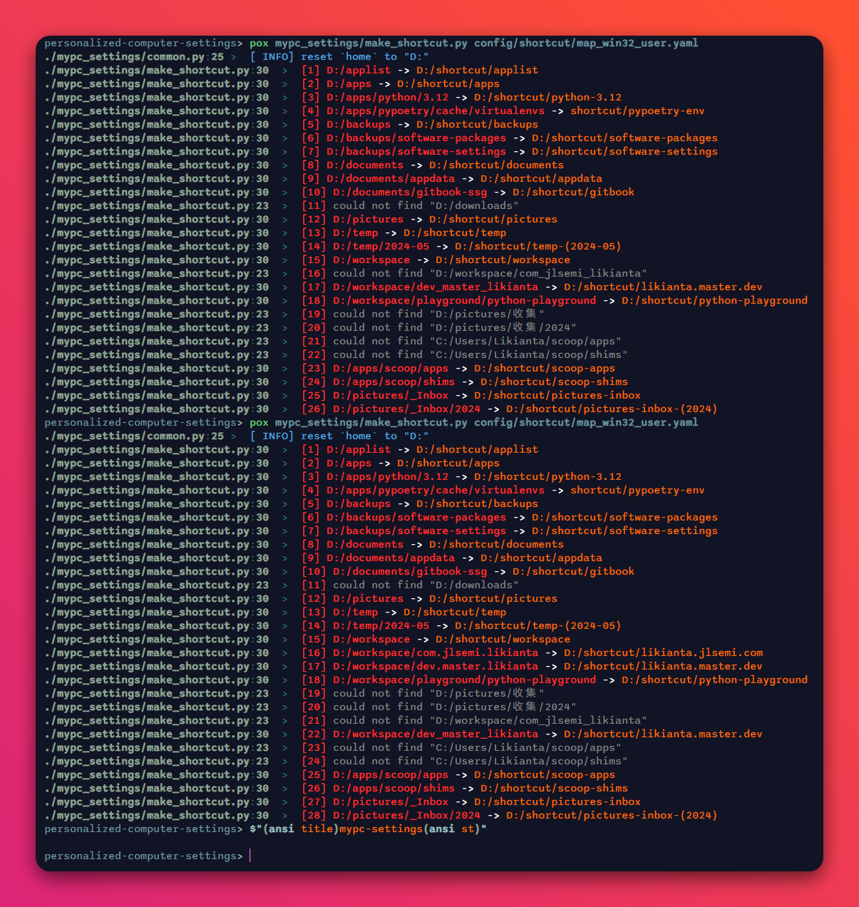

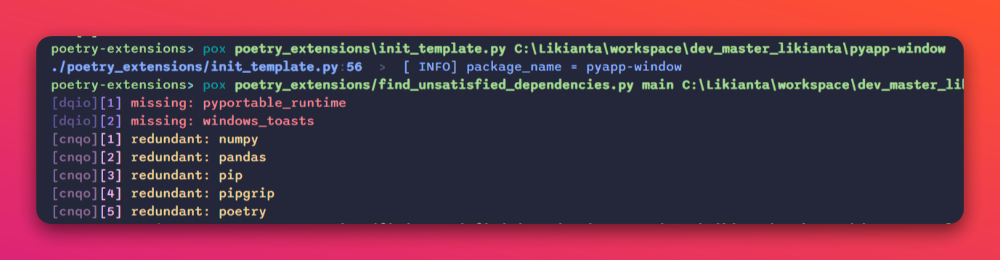

*More...*

## Markup References

A markup is a string starts with colon symbol (`:`), positioned at the first or the last among positional arguments, and came up with multiple letters and digits.

For example:

```python
print(':i', 'monday')
print(':i', 'tuesday')
print(':i', 'wednesday')
```

It prints weekdays with a numeric prefix.

**Here is a list of all available marks:**

| Mark | Description                        |
| :--- | :--------------------------------- |
| `:d` | Divider line                       |
| `:e` | Exception                          |
| `:f` | Flush                              |
| `:i` | Index                              |
| `:l` | Long/Loose format (multiple lines) |
| `:p` | Parent frame                       |
| `:r` | Rich style                         |
| `:s` | Short/Simple/Single-line format    |
| `:t` | Timestamp                          |
| `:v` | Verbosity level                    |

**Markup options:**

```
* d0: divider line
  d1: divider block                               *(not supported)*
* e0: exception trace back
  e1: exception trace back with showing locals
  e2: enter pdb                                   *(not supported)*
* f0: flush
  f1: flush cutoff
  f2: flush eddy               *(not a good option, maybe removed)*
  i0: reset index
* i1: update index
  i2: scoped counter
  i3: progress                                    *(not supported)*
* l0: long / loose / expanded (multiple lines)
  l1: inspect object
  p0: self layer
* p1: parent layer
  p2: grandparent layer                    *(be careful using p2+)*
  p3: great-grandparent layer
  p4: and so on...
* r0: rich style
  r1: rich object (rich.table.Table, rich.panel.Panel, etc.)
  r2: auto detect rich format (for a limit set of types)
* s0: short / simple / single line
  s1: builtin-like print (remains markup features)
  s2: builtin print
  t0: reset timer
* t1: stop timer and show statistics
  t2: temporary timer
* v0: trace / debug / hint (gray)
  v1: negative info (magenta)
  v2: positive info (blue)
  v3: weak success (green dim)
  v4: success (green)
  v5: weak warning (yellow dim)
  v6: warning (yellow)
  v7: weak error / failure (red dim)
  v8: error / failure (red)
```
