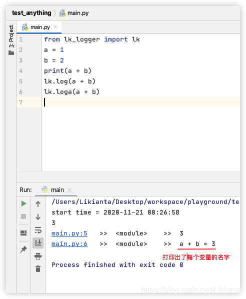

📝 English document is not complete. See Chinese version (lk-logger v3.6.3) at
<https://blog.csdn.net/Likianta/article/details/109883527>.

# Install

```
pip install lk-logger
```

# Quick Start

```python
from lk_logger import lk
a = 1
b = 2
print(a + b)
lk.log(a + b)
lk.loga(a + b)
```

Screenshot:


