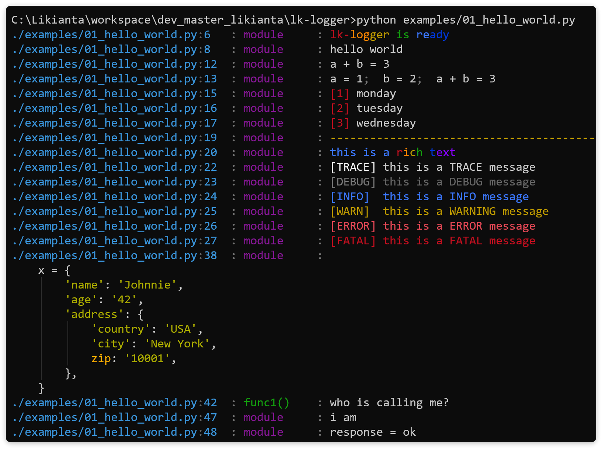

# LK Logger 日志打印工具

lk-logger 是一个简单易用的日志打印工具, 可作为 print 的替代品.

lk-logger 带来以下特性:

1. 简单. 只需两行代码即可生效.

    ```python
    import lk_logger
    lk_logger.setup()
    ```

2. 对项目的侵入性低.

    让开发者不计成本地迁移到一个新的打印库是一件困难的事, 我们给出了一个更好的选择: lk-logger 会替换内置的 print 函数, 开发者无需修改原项目中的 print 代码, 即可看到新的打印效果.

3. 打印源代码位置.

    在打印时, 会在前缀添加源代码所在的文件, 行号, 函数信息. 如下所示:

    

    在 pycharm 中, 它可以以链接的形式显示, **鼠标点击可跳转到源代码位置**.

4. 打印变量名.

    普通的打印:

    ```python
    a, b = 1, 2
    print('a = {}, b = {}, a + b = {}'.format(a, b, a + b))
    ```

    lk-logger 打印:

    ```python
    a, b = 1, 2
    print(a, b, a + b)
    ```

    

5. 高亮打印.

    

## 安装

```
pip install lk-logger
```

## 使用

**启用**

在原项目入口的顶部加入这两行代码:

```python
import lk_logger
lk_logger.setup()
```

后续所有 print 打印行为都会被替换为 lk-logger 的效果.

更多:

`lk_logger.setup()` 可传入关键字参数. 如下所示:

*TODO*

所有的关键字可在 `lk_logger/logger.py > class LoggingConfig` 找到.

**打印源码行**

```python
print('hello world')
```

**打印变量名**

需要先在 setup 中启用 `show_varnames`.

```python
import lk_logger
lk_logger.setup(show_varnames=True)
```

```python
a, b = 1, 2
print(a, b, a + b)
```

*TODO:AddScreenShot*

**高级打印**

在 print 第一个或者最后一个参数位置, 传入一个以冒号开头的字符串, 后跟多个标记符.

示例:

```python
print('[bold red]hello world[/]', ':r')
print('this is a warn message.', ':v3')
```

完整的标记符如下:

*TODO:UseTableInsteadBelow*

```
markup list
    :d  divider line
    :i  index
    :l  long / loose
    :p  parent layer
    :r  rich
    :s  short
    :t  tag
    :v  verbose / log level (trace, debug, info, warning, error, fatal)
        refer to https://stackoverflow.com/a/64806781

markup options
    :d0     default divider line (default)
    :d1+    user defined (if not, fallback to :d0)

    :i0     reset index
    :i1     number width fixed to 1 (1, 2, 3, ... 9, 10, 11, ...) (default)
    :i2     number width fixed to 2 (01, 02, 03, ..., 99, 100, 101, ...)
    :i3     number width fixed to 3 (001, 002, 003, ..., 999, 1000, 1001, ...)
    :i4~8   number width fixed to 4/5/6/7/8
    :i9+    reserved, not defined yet (will be fallback to :i1)

    :l0     let lk-print decide how to format long message (default)
    :l1     force expand all nodes

    :p0     self layer
    :p1     parent layer (default)
    :p2     grand parent layer
    :p3     great grand parent layer
    :p4     great great grand parent layer
    :p5+    great ... grand parent layer
            note: be careful using :p2+, it may crash if the layer not exists

    :v0     trace (default)
            if you don't like using number, you can use an alias :vt
    :v1     debug (alias is :vd)
    :v2     info (alias is :vi)
    :v3     warning (alias is :vw)
    :v4     error (alias is :ve)
    :v5     fatal (alias is :vf)
    :v6+    user defined (if not, fallback to :v0)
```
